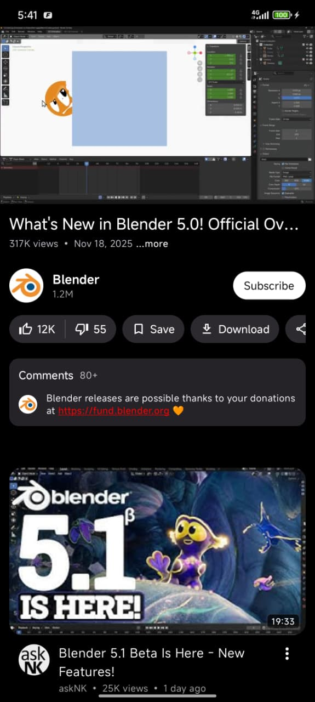
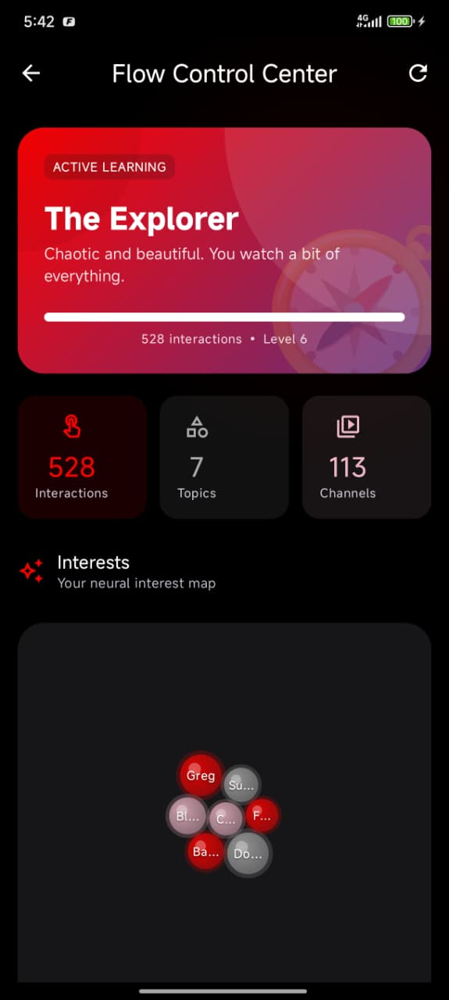
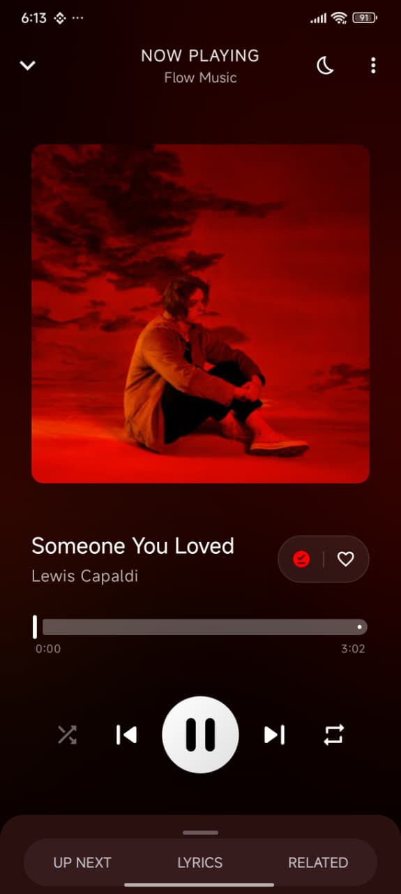
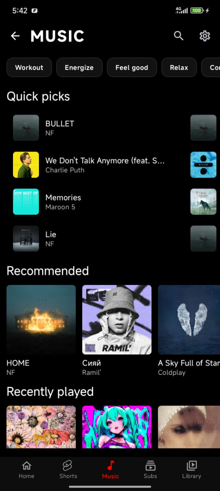
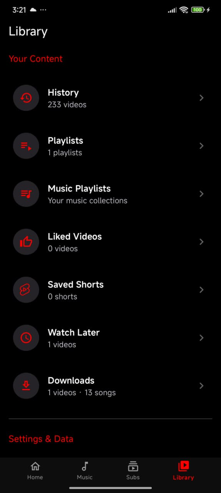
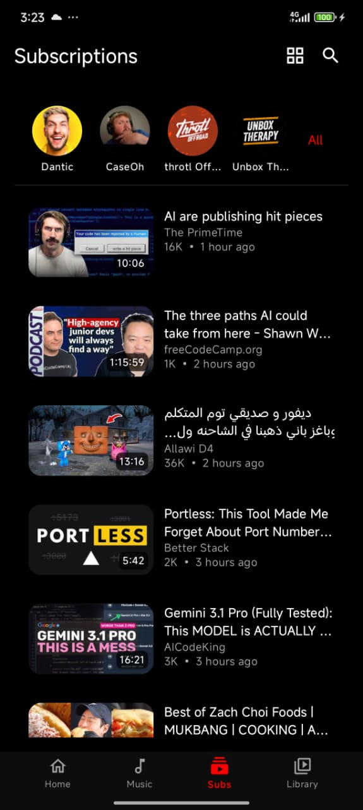
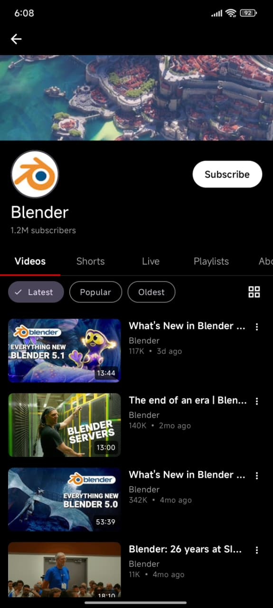
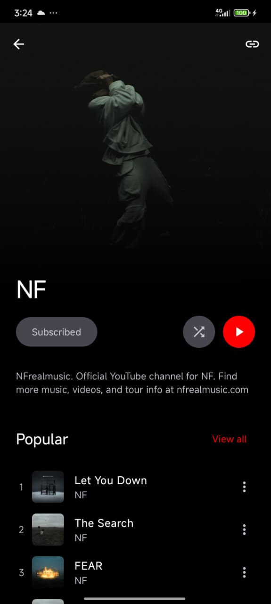

  
    
  
  

  

 

 
<!-- Downloads & Version -->

 

<!-- Tech Stack -->

 

<!-- Community & License -->

    
  
  <h3>A privacy-respecting YouTube and YouTube Music client for Android with a local recommendation engine.</h3>
  

    Flow is a YouTube client built with Jetpack Compose and Material 3. 
    It includes FlowNeuro, a recommendation engine that runs entirely on your device — no accounts, no tracking, no data leaves your phone.
  

  
  

    <a href="https://github.com/A-EDev/Flow/releases"><b>Download APK</b></a> · 
    <a href="https://github.com/A-EDev/Flow/wiki"><b>Documentation</b></a> · 
    <a href="https://www.reddit.com/r/Flow_Official/"><b>Subreddit</b></a> · 
    <a href="#support--donations"><b>Donate</b></a> .
    <a href="#translate"><b>Translations</b></a>
  

---

## Why Flow?

Most open-source YouTube clients give you playback but no way to discover new content. You either use the official app and get tracked, or you use an alternative and lose recommendations entirely.

Flow gives you both. The recommendation engine learns what you like by analyzing your watch behavior locally. It never leaves your devices. You can inspect everything it knows about you, adjust it, or wipe it at any time.

---

## Features

### Video
- High-quality playback via ExoPlayer (Media3) with resolution switching (1080p, 720p, 480p, 360p)
- SponsorBlock — automatically skips sponsors, intros, outros, and filler
- DeArrow — replaces clickbait thumbnails and titles with community-sourced alternatives
- Return Youtube Dislike (RYD)
- Background playback — listen to audio with the screen off
- Picture-in-Picture — keep watching while using other apps
- Casting to smart TVs and streaming devices
- Playback speed control (0.25x to 2x)
- Video chapters with seek jumping
- Gesture controls for brightness, volume, and seeking
- Subtitles with customizable font size, color, and background
- Downloads with VP9, AV1, and standard format support
- Resume playback from where you left off

### Music
- Dedicated music player with album art and audio visualizations
- Queue management with add, remove, and reorder
- Shuffle and repeat (single/all)
- Persistent mini player across the app
- Synchronized lyrics display
- Fetches tracks from YouTube Music

### Recommendations (FlowNeuro Engine)
- Runs 100% on-device — no server, no telemetry, no account needed
- Learns from what you watch, skip, like, dislike, search for, and how long you watch
- Distinguishes weekday and weekend patterns, morning and night preferences
- Detects when you're getting bored of a topic and mixes in new content
- Prevents your feed from collapsing into the same 2-3 topics
- Surfaces related videos from your recent watches to create natural topic transitions
- Uses engagement signals (like-to-view ratios) to filter out low-quality content
- Full transparency dashboard — see what the algorithm knows and why it recommended something
- Export/import your entire recommendation profile as a file

### Library
- Local watch history
- Favorites and custom playlists
- Shorts feed with bookmarking
- Continue watching shelf
- Subscription management with cached feeds

### Privacy
- No Google account required
- No ads, analytics, or tracking
- All data stored locally on your device
- Import subscriptions and history from NewPipe
- Export or delete everything at any time

### Appearance
- 11 themes: Light, Dark, OLED Black, Ocean Blue, Forest Green, Sunset Orange, Purple Nebula, Midnight Black, Rose Gold, Arctic Ice, Crimson Red
- Built entirely with Jetpack Compose and Material 3

---

## Screenshots

  <table>
    <tr>
      <td align="center"><b>Home Feed</b> </td>
      <td align="center"><b>Video Player</b> </td>
      <td align="center"><b>Personality Screen</b> </td>
    </tr>
    <tr>
      <td align="center"><b>Music Player</b> </td>
      <td align="center"><b>Music Hub</b> </td>
      <td align="center"><b>Your Library</b> </td>
    </tr>
    <tr>
      <td align="center"><b>Shorts</b> </td>
      <td align="center"><b>Subscriptions</b> </td>
      <td align="center"><b>Channel View</b> </td>
    </tr>
    <tr>
      <td align="center"><b>Artist Page</b> </td>
      <td align="center"></td>
      <td align="center"></td>
    </tr>
  </table>

---
## Download

### Stable Release

  <table border="0">
    <tr>
      <td align="center" style="vertical-align: middle; padding: 10px;">
        
      </td>
      <td align="center" style="vertical-align: middle; padding: 10px;">
        
      </td>
      <td align="center" style="vertical-align: middle; padding: 10px;">
        
      </td>
    </tr>
  </table>

### Nightly / Debug Build
> ⚠️ Nightly builds are unstable and may contain bugs. Use at your own risk.

  
  
<b>No GitHub account required</b> — powered by <a href="https://nightly.link">nightly.link</a>

### Requirements 
**Minimum Requirement:** Android 8.0+

### Verifying Authenticity
To ensure the authenticity of the APK and verify it has not been tampered with, you can check the signing certificate fingerprint using tools like [AppVerifier](https://github.com/soupslurpr/AppVerifier).

**Release Certificate SHA-256 Fingerprint:**
`43:22:29:4E:D4:CA:A2:D4:29:41:40:09:58:18:08:0F:FE:8A:CC:1F:BE:3C:DC:76:10:7D:F4:5C:52:86:BE:40`

---

## 💰 Support Development

Flow is a free and open-source project. As an independent developer without traditional banking access, keeping this project alive relies entirely on community support. 

**You can now easily support the project using a Credit Card, Apple Pay, or PayPal via Patreon!** (You can choose to support monthly, or just leave a simple one-time tip in the shop).

 

**Prefer to send Crypto directly?**
If you already use crypto, you can send it directly to my wallets below:

| Coin | Network | Address |
| :--- | :--- | :--- |
| **USDT** | TRC20 (Tron) | `TRz7VDrTWwCLCfQmYBEJakqcZgbFNWfUMP` |
| **Bitcoin** | BTC | `bc1qgmkkxxvzvsymtpfazqfl93jw6k4jgy0xmrtnv8` |
| **Ethereum** | ERC-20 | `0xfbac6f464fec7fe458e318971a42ba45b305b70e` |
| **Solana** | SOL | `7b3SLgiVPb8qQUvERSPGRWoFoiGEDvkFuY98M1GEngug` |
| **Monero** | XMR | `8AgaxZnpEvT8VXJpczpL7BQejwSEw97saJmKYqq4zKErbe9bkYSwUhJ813msPPbdYhF11oz4N7tfEj4Zi6k27fKD83ca1if` |

*Your support helps me maintain the project and add amazing new features!*

---

## 🙏 Acknowledgments

Flow stands on the shoulders of giants. Special thanks to:

*   **[NewPipeExtractor](https://github.com/TeamNewPipe/NewPipeExtractor):** The backbone of our data extraction.
*   **[NewPipe](https://github.com/TeamNewPipe/NewPipe):** For inspiration from their solid foundation for YouTube data handling.
*   **[MetroList](https://github.com/MetrolistGroup/Metrolist):** Inspiration for the Hybrid Music fetching approach, Lyrics handling and some icons design references.
*   **[LibreTube](https://github.com/LibreTube/LibreTube):** Inspiration for SponsorBlock and DeArrow handling and some icons design references.
*   **[ExoPlayer](https://github.com/google/ExoPlayer):** The gold standard for Android media playback.
*   **[Jetpack Compose](https://developer.android.com/jetpack/compose):** For enabling the beautiful, modern UI.
*   **[Material Design 3](https://m3.material.io/):** For the design system and guidelines.

---

## Translations
Help translate Flow into your language! 

---

## 📄 License & Copyright

**Flow** is Free Software: You can use, study, share, and improve it at your will.
It is distributed under the **GNU General Public License v3 (GPLv3)**.

**Copyright © 2025-2026 A-EDev**

> 🚨 **For Developers:**
> This license requires that any project using Flow's source code (including the `FlowNeuroEngine` algorithm) must also be **Open Source** under the GPLv3 license. You may not use this code in a proprietary or closed-source application.

---

## Star History

<a href="https://www.star-history.com/?repos=A-EDev%2FFlow&type=date&legend=top-left">
 <picture>
   <source media="(prefers-color-scheme: dark)" srcset="https://api.star-history.com/chart?repos=A-EDev/Flow&type=date&theme=dark&legend=top-left" />
   <source media="(prefers-color-scheme: light)" srcset="https://api.star-history.com/chart?repos=A-EDev/Flow&type=date&legend=top-left" />
   
 </picture>
</a>

---

  Made with ❤️ by A-EDev

